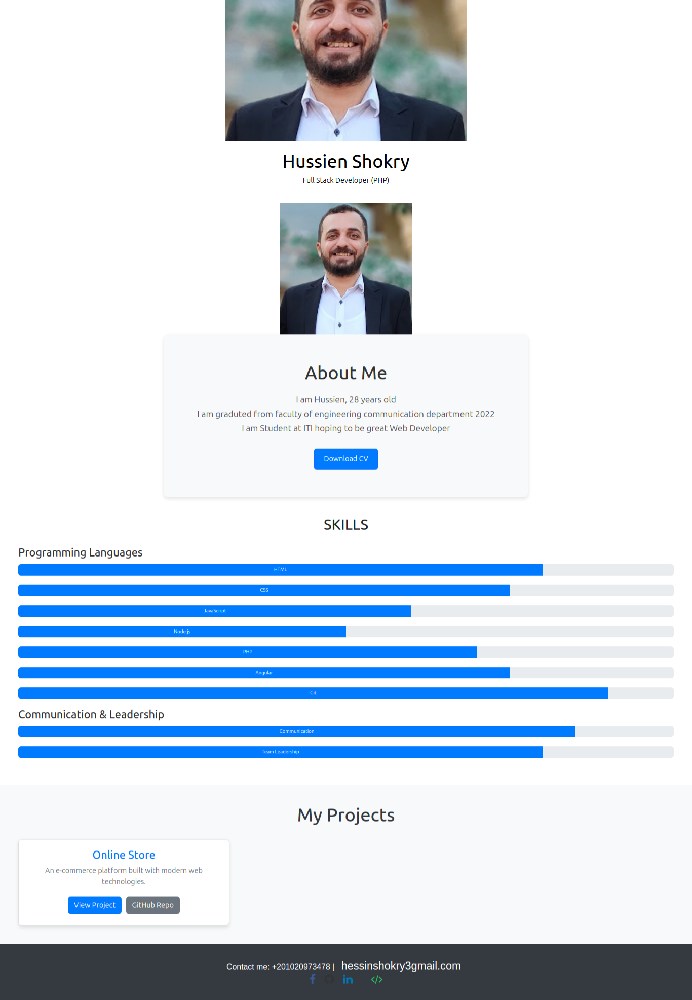

# Portfolio

A modern, responsive portfolio website built with Angular 18.1.3 showcasing professional experience, skills, and projects.

## Features

- Hero section with personal introduction
- Bio/About section
- Skills showcase
- Portfolio/Projects display
- Footer with contact information

## Project Structure

```
src/
├── app/
│   ├── hero/         # Hero section component
│   ├── bio/          # Bio/About section component
│   ├── skills/       # Skills section component
│   ├── portfolio/    # Portfolio section component
│   └── footer/       # Footer component
```

## Screenshots



## Development

### Prerequisites

- Node.js
- Angular CLI 18.1.3

### Setup

1. Clone the repository
2. Run `ng serve` for development server
3. Navigate to `http://localhost:4200/`

### Building

Run `ng build` to build the project. Build artifacts will be stored in `dist/` directory.

### Testing

- `ng test` - Run unit tests via Karma
- `ng e2e` - Run end-to-end tests

## Technologies Used

- Angular 18.1.3
- TypeScript
- SCSS
- Angular CLI
